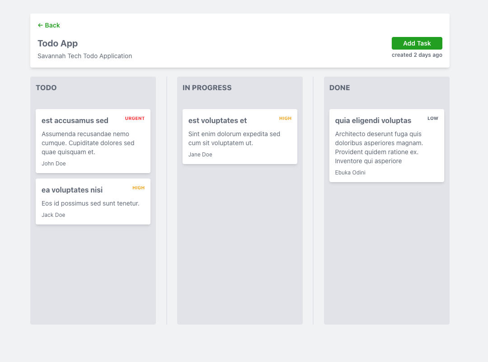
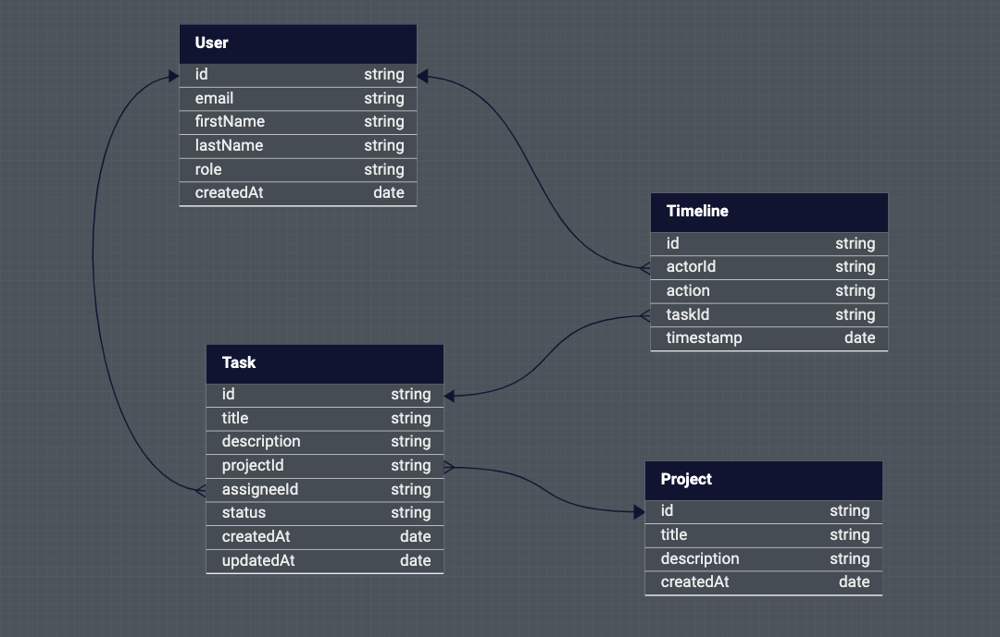

# TASK MGT

TASK MGT is a simple task management app.

![MIT License][license-shield]

## Table of Contents

- [TASK MGT](#task-mgt)
  - [Table of Contents](#table-of-contents)
- [Overview](#overview)
- [Technolgies and Features](#technolgies-and-features)
- [Architectures](#architectures)
  - [Separation of Concerns (SoC) / Modular Architecture](#separation-of-concerns-soc--modular-architecture)
  - [Dependency Injection (DI)](#dependency-injection-di)
- [Assumptions](#assumptions)
- [API Documentation](#api-documentation)
- [Setup](#setup)
  - [Installation](#installation)
  - [Usage](#usage)
  - [Credentials](#credentials)

---

# Overview
Application


DB Schema


# Technolgies and Features
- Technology used in the Frontend: React, Typescript, Tailwind, Socket.io, Zustand (for state management).
- Technology used in the Backend: Express, Typescript, MongoDB, Socket.io, Jest, Prisma.
- Key features
  - Authentication with JWT
  - Role Based Authtorization
  - New users can sign up
  - Users can easily navigate through projects and tasks.
  - All users can create tasks
  - All users can drag and drop tasks accross the board column
  - All users can update a task
  - Only admins can delete tasks

# Architectures

## Separation of Concerns (SoC) / Modular Architecture
A fundamental principle of software engineering that emphasizes the importance of dividing a system into distinct modules or components, each with a specific and independent responsibility. 

For this project, SoC was implemented using a modular architecture, where each module is responsible for a single task or functionality.

## Dependency Injection (DI)
In Clean Architecture, dependencies are injected, which means the higher-level modules should depend on lower-level modules. This ensures that the business logic is not coupled with the infrastructure details.

For this task, this architecture was implemtented at the database level to enable testing and database mocking.

# Assumptions
These are some assumptions made when developing this application:

- Projects already exists in the system.
- The Admin user already exists in the system.
- The system is a passwordless application.
- All lesson videos are youtube videos.
- This application is only to be used on a desktop screen (no compatibility with mobile screens).

# API Documentation
Here is a link to the [Postman Docs][postman].

# Setup

## Installation

Pre-requisite: Make sure you have [docker][dc] setup on your machine.

1. Clone the repository:

```bash
$ git clone https://github.com/ebukaodini/task-mgt.git
```

2. Setup environment variables:

```bash
$ cp api/.env.sample api/.env
$ cp app/.env.sample app/.env 
```

3. Build the docker image and spin up services:

```bash
$ docker-compose up -d --build
```

## Usage

Open the application on your browser: [`http://localhost:4000`][app] 

## Credentials
These are the default accounts seeded into the database. Use them for different the roles.

- admin@example.com - `ADMIN`
- john.doe@example.com - `USER`
- jane.doe@example.com - `USER`

[dc]: https://docs.docker.com/compose/
[app]: http://localhost:4000
[license-shield]: https://img.shields.io/github/license/ebukaodini/task-mgt.svg?style=flat-square
[postman]: https://documenter.getpostman.com/view/6884204/2sAXjRW9kH